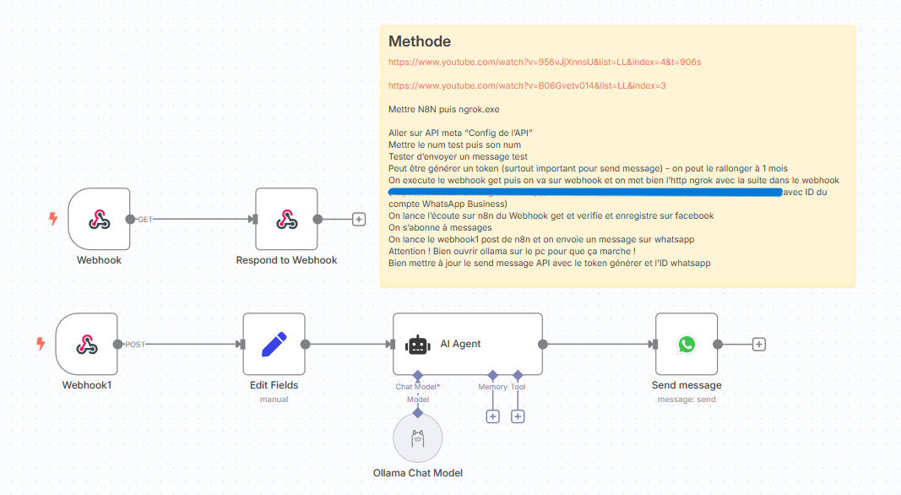
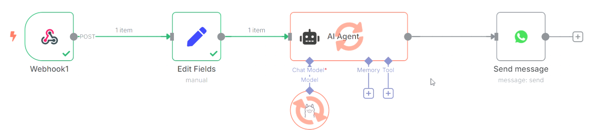

# 💬🤖 WhatsApp Chat with Local LLM via n8n

  
  

---

## 📝 Project Description
This project connects **WhatsApp messages** directly to a **local AI model (LLM via Ollama)** using **n8n**, **Meta’s WhatsApp Cloud API**, and **ngrok**.  
Every time you send a message from WhatsApp, it passes through n8n → a local AI → and the AI’s response is sent back to WhatsApp.  

⚡️ Essentially, in this project, you’re chatting with your own locally hosted AI — through WhatsApp! (So you can add RAG confidentially)

---

## ⚙️ Features

🧠 **Local LLM processing** — Messages are handled by your own AI model (via Ollama).  

🌐 **WhatsApp Business API integration** — Uses Meta’s secure cloud API to send/receive messages.  

🪄 **n8n automation** — Full workflow to connect, process, and respond automatically.  

🧩 **Modular structure** — Easy to adapt for different AI models or APIs.  

🚀 **Real-time chat** — Immediate responses directly inside WhatsApp.

---

## 🧠 Example Workflow

Here’s what the n8n workflow looks like:

This shows:
- Webhooks handling WhatsApp messages  
- Ollama Chat Model generating intelligent replies  
- Automatic sending of responses via the WhatsApp API

In action:

Here is the result (in French):

---

## ⚙️ How it Works

1. 🧩 **Incoming message** → WhatsApp sends a message to your **n8n webhook**.  
2. 🔄 **Edit Fields** → Message is cleaned and formatted for AI processing.  
3. 🧠 **AI Agent (Ollama Chat Model)** → Your local AI generates a response.  
4. 📤 **Send Message** → The AI reply is sent back to the user through the WhatsApp API.  

All communication happens **locally** except the WhatsApp API calls via Meta’s servers.  
ngrok is used to make your local n8n instance accessible to the Meta API.

---

## 🧰 Node Description

| Node | Description |
|------|--------------|
| 🌐 **Webhook (GET)** | Used for Meta’s webhook verification |
| 📨 **Webhook (POST)** | Receives messages sent from WhatsApp |
| ✏️ **Edit Fields** | Formats the text before sending to AI |
| 🧠 **AI Agent (Ollama Chat Model)** | Generates a response using your local AI |
| 💬 **Send Message** | Sends the AI’s response back to the WhatsApp user |

---

## 📖 Inspiration / Sources  

Here is the video I used :
- [Build a Free WhatsApp AI Chatbot on Your Local PC - No Cloud Required!](https://www.youtube.com/watch?v=956vJjXnnsU&list=LL&index=4)
- [How To Connect WhatsApp To n8n Without Having a Business! (Step-By-Step Tutorial)](https://www.youtube.com/watch?v=B06Gvetv014&list=LL&index=3)

Project created by me 😎, Thibault GAREL - [Github](https://github.com/Thibault-GAREL)
